### Diag usecase Global
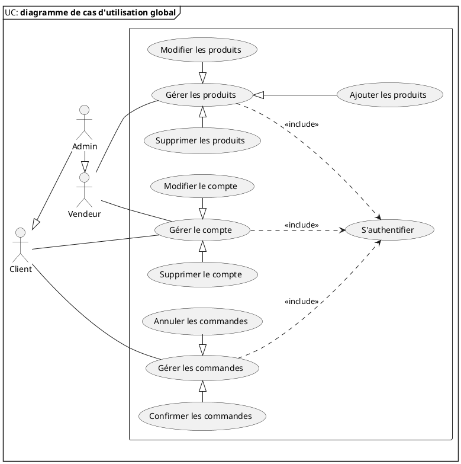
### Diag usecase gerer compte
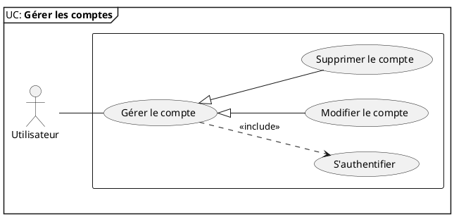
### Diag usecase gerer produit
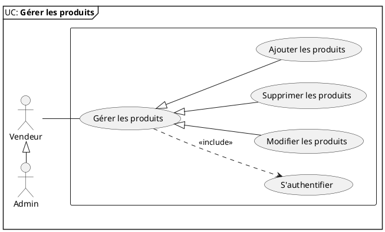

### Diag usecase gerer commande
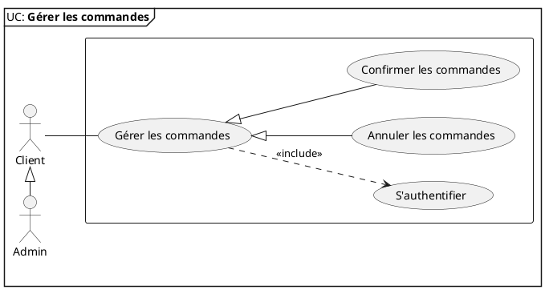
### Diag de classe s'authentifier
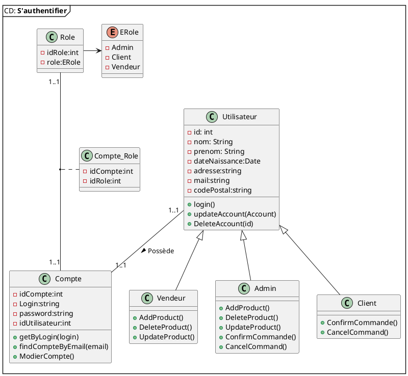

### Diag de classe gerer compte
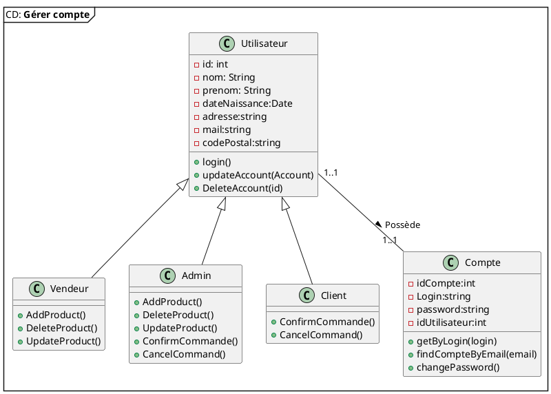

### Diag de classe gerer produit
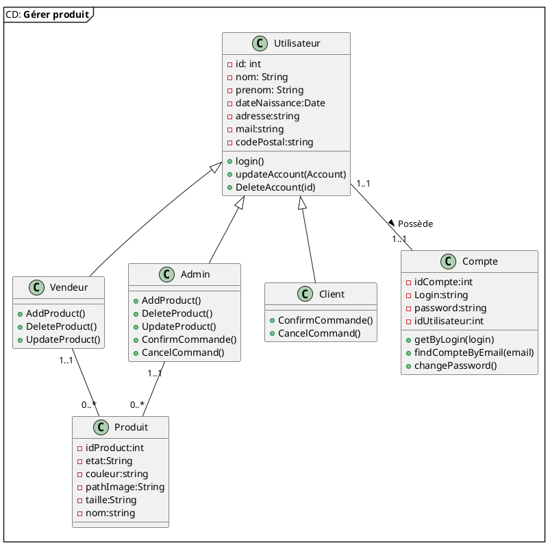

### Diag de classe gerer commande
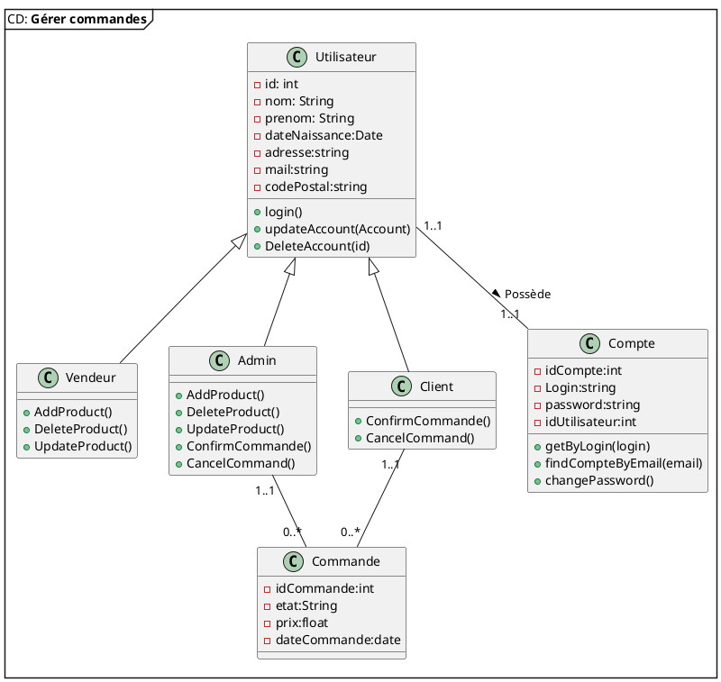
### Diagramme de séquence s'authentifier

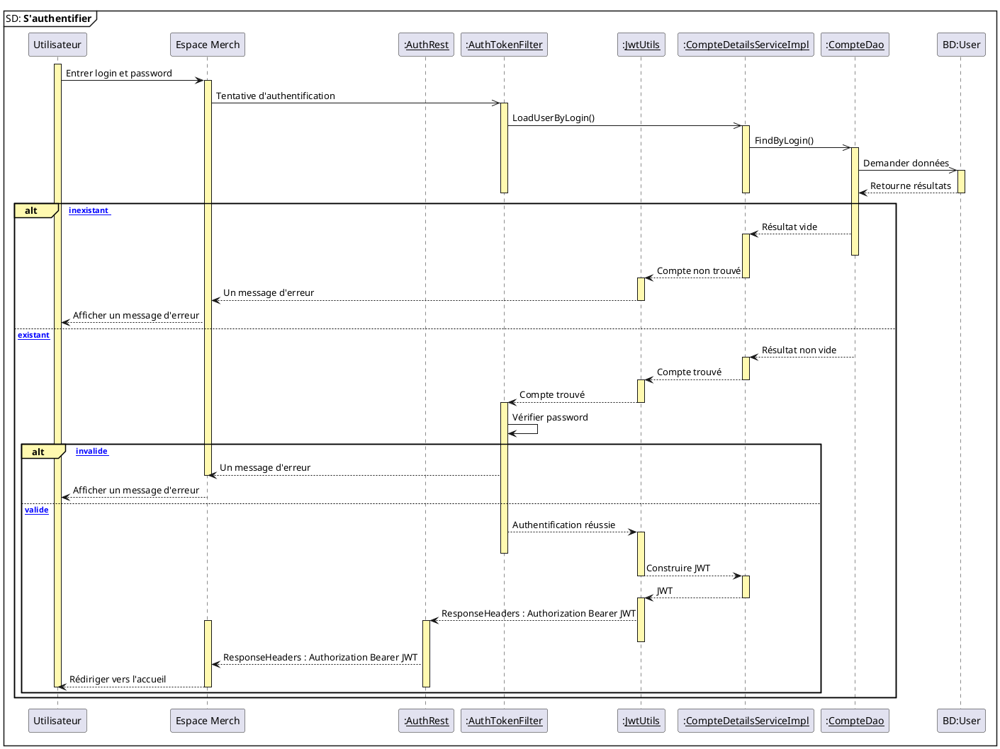

### Diagramme de séquence Modifier compte

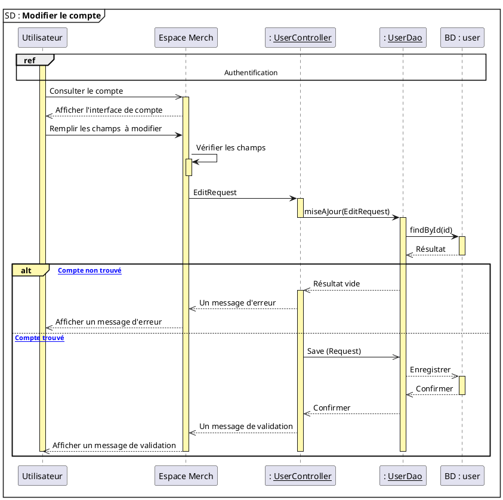

### Diagramme de séquence Ajouter produit

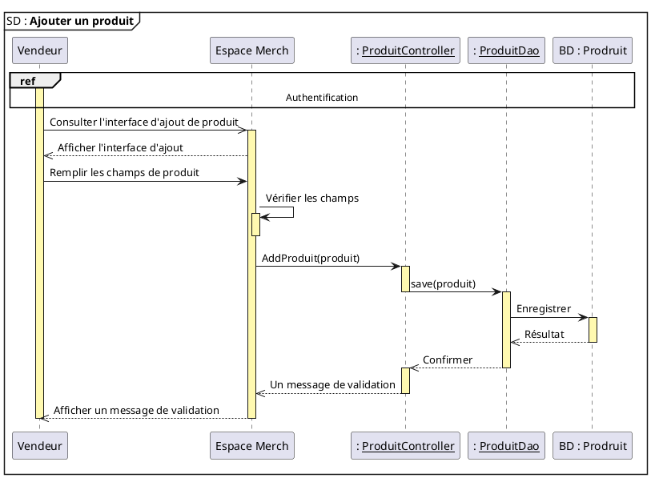

### Diagramme de séquence Confirmer commande

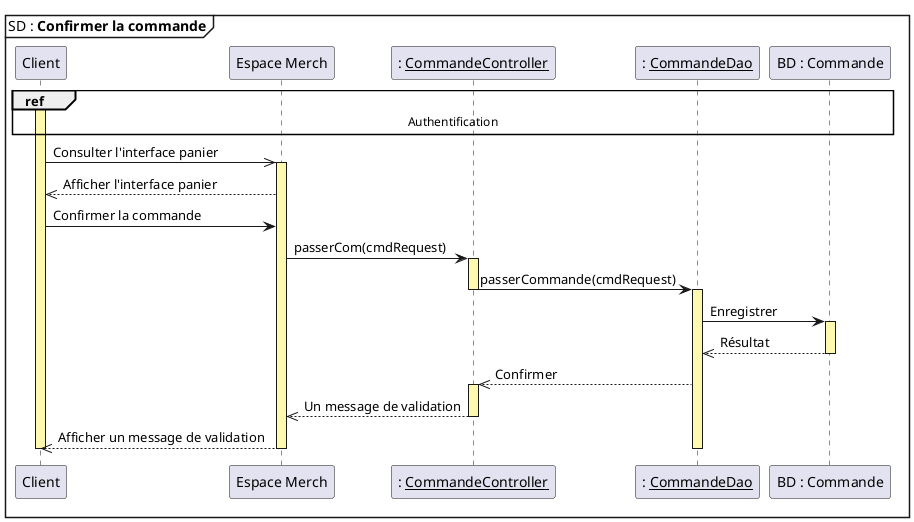

